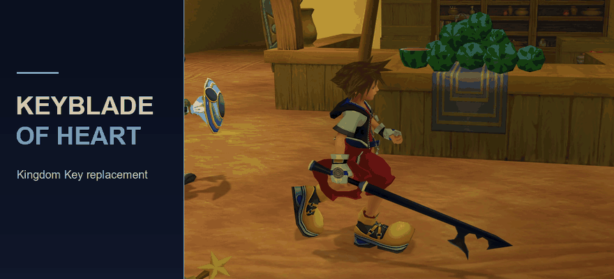

# Keyblade of Heart

[Download](https://github.com/ROXASBrandon/KH1FM-Keyblade-of-Heart/releases/latest) · [Report a bug](https://github.com/ROXASBrandon/KH1FM-Keyblade-of-Heart/issues)

Replace Kingdom Key with Riku's **Keyblade of Heart**, featuring its authentic model, dark blue swing trail, and sword swing sounds. Sora keeps his normal animations, while Kingdom Key keeps its stats and abilities.

Compatible with my [Keyblade Transmog mod](https://github.com/ROXASBrandon/KH1FM-Keyblade-Transmog).

## Features

- Riku's Keyblade of Heart model and textures, adapted to Sora's weapon grip.
- Black-to-blue swing trail using Riku's trail texture and blending.
- Riku's sword swing recordings mapped to Kingdom Key's swing sounds.
- Cosmetic replacement: no changes to weapon stats, abilities, progression, or saves.

Equip Kingdom Key to use the replacement. When using Transmog, select the Kingdom Key appearance to display Keyblade of Heart while keeping your equipped weapon's stats.

## Requirements

Kingdom Hearts Final Mix on Steam and OpenKH Mods Manager with Panacea. This mod alone does not require LuaBackend.

## Installation

1. Download the mod ZIP from [Releases](https://github.com/ROXASBrandon/KH1FM-Keyblade-of-Heart/releases/latest).
2. Close Kingdom Hearts normally.
3. Select **Kingdom Hearts 1** in OpenKH Mods Manager.
4. Open **Mods > Install new mods** or click **+**, choose **Select and install Mod Archive or Lua Script**, and select the downloaded ZIP without extracting it.
5. Enable **Keyblade of Heart over Kingdom Key**, then click **Build and Run**.
6. Equip **Kingdom Key**.

For updates, close the game, remove the previous imported copy, import the new ZIP, and rebuild. Keep one copy enabled.

## Notes

The inventory name remains Kingdom Key. Sora's moveset, attack timing, and normal impact/guard sounds stay unchanged. The trail follows Sora's swings; this does not add Riku's boss moveset. Other mods replacing the same Kingdom Key assets can overwrite this replacement.

Tested independently and alongside Keyblade Transmog through OpenKH Build and Run.

## Removal

Close the game, disable this mod in OpenKH, and rebuild your enabled mods.

## Source and credits

Build and asset details are in [development notes](DEVELOPMENT.md). Original game assets belong to Square Enix and Disney; see [credits](CREDITS.md).

## My other mods

- [Keyblade Transmog](https://github.com/ROXASBrandon/KH1FM-Keyblade-Transmog) — cycle Keyblade appearances while keeping equipped stats and abilities.
- [Treasure Magnet Starter](https://github.com/ROXASBrandon/KH1FM-Treasure-Magnet-Starter) — early unlock, zero AP.
- [Treasure Magnet Vacuum](https://github.com/ROXASBrandon/KH1FM-Treasure-Magnet-Vacuum) — expanded pickup range for items and HP/MP/munny orbs.
